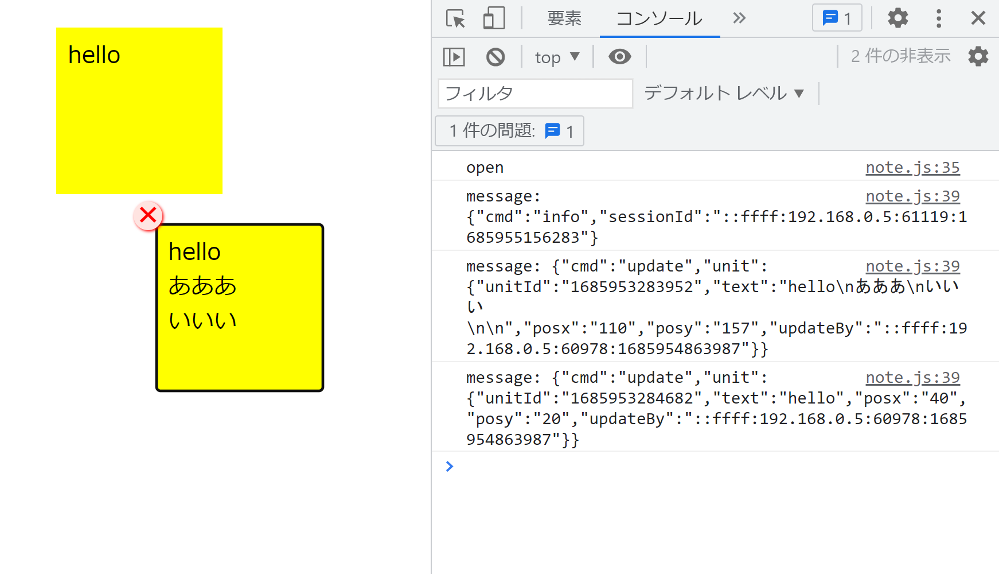
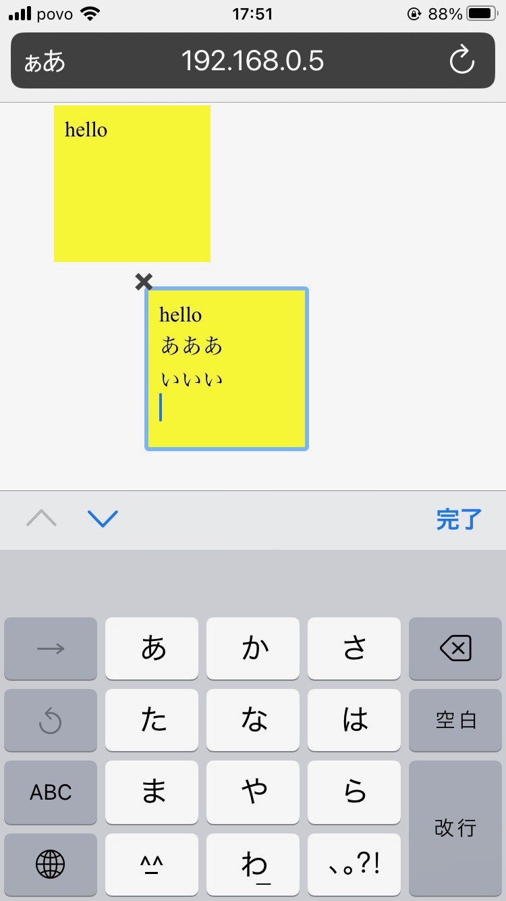

# node-websocket-note

node.jsとwebsocketで共有ノート的なものに必要な仕組みを確認

## 使い方

### サーバー

```
>node server.js
Mon Jun 05 2023 17:40:17 GMT+0900 (日本標準時) listen http://192.168.0.5:3000
```

### クライアント（ブラウザ）

http://localhost:3000 または サーバーコンソールに表示されたURLにアクセス

+ 背景クリック（タップ）で枠追加。
+ 枠クリックで編集モード、枠外クリックで編集終了。
+ 編集モードに入ったとき現れる✖クリックで枠削除。
+ 枠ドラッグで移動。
+ 編集状況は随時サーバーに保存され、リロードや新規クライアントからの接続時に状況再現。
+ ChromeとSafariで動いている。





[Post it icons created by Freepik - Flaticon](https://www.flaticon.com/free-icons/post-it)
